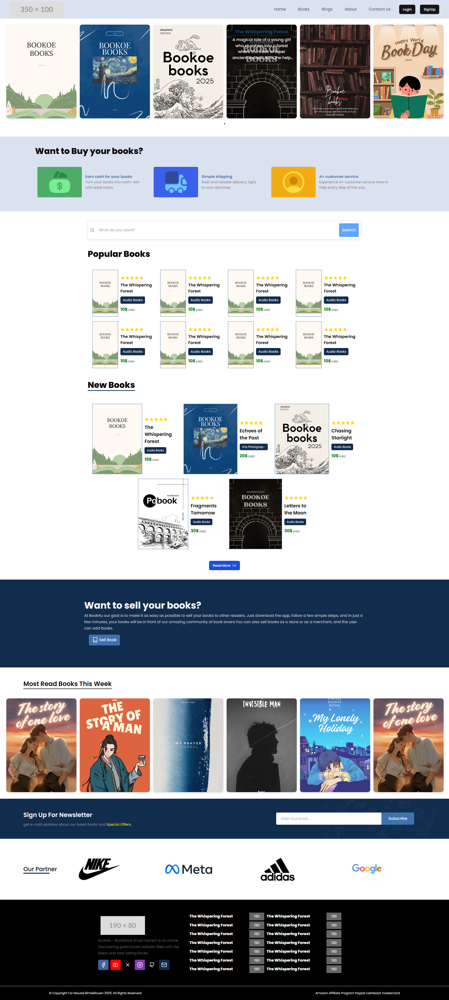

# Books Selling Store - React

This is a **Books Selling Store** built using **React**, **Tailwind CSS**, **Sass**, and **CSS**. The store supports multiple languages, providing a dynamic and responsive shopping experience.

## Technologies Used
- **React** for building the user interface.
- **Tailwind CSS** for utility-first CSS styling.
- **Sass** for maintaining and extending CSS styles.
- **CSS** for custom styling.

## Features
- Multi-language support.
- Fully responsive and mobile-friendly design.
- Modern UI with an intuitive shopping experience.

## Contributing
If you encounter any issues or would like to suggest improvements, feel free to open an issue or submit a pull request.

## Home Page

